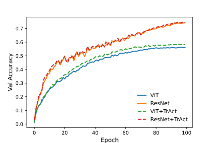

## open-TrAct

---
[](https://arxiv.org/abs/2410.23970)
 
Implementation of **"[TrAct: Making First-layer Pre-Activations Trainable](https://openreview.net/forum?id=gCCMzedgbo)"** [2024]. The paper proposes a gradient modification scheme which corrects for an over-emphasis on the first layer of continuous domain models. In such cases, the impact from the input data is double-counted resulting in faster learning, thereby leading to performance degradation.

#### Note
The authors of the original paper intend to release code for their implementation. This repository will be updated at that point.

## Please Cite the Original Paper

```
@inproceedings{
petersen2024tract,
title={TrAct: Making First-layer Pre-Activations Trainable},
author={Felix Petersen and Christian Borgelt and Stefano Ermon},
booktitle={The Thirty-eighth Annual Conference on Neural Information Processing Systems},
year={2024},
url={https://openreview.net/forum?id=gCCMzedgbo}
}
```

---

## Usage

Our implementation uses a wrapper functionality, which replaces `nn.conv` and `nn.Linear` layers. It will retain the `weight` and `bias` parameters, allowing for interoperability with existing networks without polluting the state dict paths. 

#### Examples:

```python
import torch.nn as nn
from tract import TrAct

myTrActLinear = TrAct(nn.Linear(in_features, out_features), lambda_=0.1)
myTrActConv = TrAct(nn.Conv2d(in_features, out_features, kernel_size), lambda_=0.1)

myModel.proj_in = TrAct(myModel.proj_in, lambda_=0.1)
```

#### Currently Supports:
- `nn.Linear`
- `nn.Conv1d`
- `nn.Conv2d`
- `nn.Conv3d`
- Mixed Precision by casting gradients to Float32 (necessary for the `linalg.inverse` operation)

#### Note:
TrAct should **ONLY** be applied to the **FIRST** layer. The implementation does not forward gradients beyond this layer, making it unsuitable for applications where additional gradient flow is desired (e.g. a GAN discriminator). 


---
## Test Examples

We test our implementation using a ResNet and ViT model on CIFAR-100 following the hyperparameters proposed in the original paper. We find that there is a significant improvement for the Vision Transformer case, but not for the ResNet model. Notably, both models were very small, which could have an impact on the results. Both models were trained for 100 Epochs using CosineAnnealing with warmup. 

<table>
  <thead>
   <tr>
   <th> Model </th>
   <th> Params </th>
   <th> FLOPs </th>
   <th> Optim </th>
   <th> Config </th>
  </tr>
  </thead>
  <tbody>
    <tr>
    <td> ResNet </td>
    <td> 2.96M </td>
    <td> 423M </td>
    <td> SGD, lr=0.08 </td>
    <td> blocks=(2,2,2), channels=(64, 128, 256) </td>
    </tr>
    <tr>
    <td> ViT </td>
    <td> 2.51M </td>
    <td> 154M </td>
    <td> Adam, lr=1e-3 </td>
    <td> L=12, d=128, h=4, d<sub>k</sub>=32 </td>
  </tbody>
  </table>
   
   
   
   
   
   Note that the lower performance of the ViT can be attributed to two factors:
   - Lower FLOPs compared to the ResNet
   - Known underperformance of Isotropic models compared with Pyramidal models at small sizes
 
   
   
   
   
   
   
   
   
   
   
   
   
   
   
   
   
   
   
