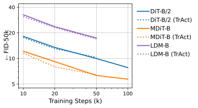

## open-TrAct

---
[](https://arxiv.org/abs/2410.23970)
 
Implementation of **"[TrAct: Making First-layer Pre-Activations Trainable](https://openreview.net/forum?id=gCCMzedgbo)"** [2024]. The paper proposes a gradient modification scheme which corrects for an over-emphasis on the first layer of continuous domain models. In such cases, the impact from the input data is double-counted resulting in faster learning, thereby leading to performance degradation.

#### Note:
The authors of the original paper intend to release code for [their implementation](https://github.com/Felix-Petersen/tract). This repository will be updated at that point.

## Please Cite the Original Paper

```
@inproceedings{
petersen2024tract,
title={TrAct: Making First-layer Pre-Activations Trainable},
author={Felix Petersen and Christian Borgelt and Stefano Ermon},
booktitle={The Thirty-eighth Annual Conference on Neural Information Processing Systems},
year={2024},
url={https://openreview.net/forum?id=gCCMzedgbo}
}
```

---

## Usage

Our implementation uses a wrapper functionality, which replaces `nn.conv` and `nn.Linear` layers. It will retain the `weight` and `bias` parameters, allowing for interoperability with existing networks without polluting the state dict paths. 

#### Examples:

```python
import torch.nn as nn
from tract import TrAct

myTrActLinear = TrAct(nn.Linear(in_features, out_features), lambda_=0.1)
myTrActConv = TrAct(nn.Conv2d(in_features, out_features, kernel_size), lambda_=0.1)

myModel.proj_in = TrAct(myModel.proj_in, lambda_=0.1)
```

#### Currently Supports:
- `nn.Linear`
- `nn.Conv1d`
- `nn.Conv2d`
- `nn.Conv3d`
- Mixed Precision by casting gradients to Float32 (necessary for the `linalg.inverse` operation)

#### Note:
TrAct should **ONLY** be applied to the **FIRST** layer. The implementation does not forward gradients beyond this layer, making it unsuitable for applications where additional gradient flow is desired (e.g. a GAN discriminator). 


---
## Testing Classification (CIFAR-100)

We test our implementation using a ResNet and ViT model on CIFAR-100 following the hyperparameters proposed in the original paper. We find that there is a significant improvement for the Vision Transformer case, but not for the ResNet model. Notably, both models were very small, which likely impacts the results as proposed by the original paper (larger gains for ResNet-152 vs ResNet-18). Both models were trained for 100 epochs using CosineAnnealing with a 5 epoch warmup. 

<table>
  <thead>
   <tr>
   <th> Model </th>
   <th> Params </th>
   <th> FLOPs </th>
   <th> Optim </th>
   <th> Config </th>
  </tr>
  </thead>
  <tbody>
    <tr>
    <td> ResNet </td>
    <td> 2.96M </td>
    <td> 423M </td>
    <td> SGD, lr=0.08 </td>
    <td> blocks=(2,2,2), chans=(64, 128, 256) </td>
    </tr>
    <tr>
    <td> ViT </td>
    <td> 2.51M </td>
    <td> 154M </td>
    <td> Adam, lr=1e-3 </td>
    <td> L=12, d=128, h=4, d<sub>k</sub>=32 </td>
  </tbody>
  </table>
   
   
   
   
<div align="center">
<picture>
  <source media="(prefers-color-scheme: dark)" srcset="assets/cifar_100.svg">
  
</picture>
</div>

   Note that the lower performance of the ViT can be attributed to three factors:
   - Lower FLOPs compared to the ResNet
   - Known underperformance of Isotropic models compared with Pyramidal models at small sizes
   - ViTs require more epochs than conv-nets to achieve peak accuracy
   
   
---
## Testing Generation (Diffusion)

Given the classification results, we test the impact of TrAct on diffusion models. We consider B-scale models trained on FFHQ-256 for 50k steps. For architectures, we consider DiT (Peebles & Xie, 2023) with 2x2 patch embeddings, and MDiT (Fixelle & Stan, 2024) with 1x1 patch embeddings, and LDM (Rombach et al., 2022) with 3x3 convolutions. For consistency, all models are trained with x<sub>0</sub> prediction using a cosine noise schedule and Min-SNR (Hang et al., 2023). We compare all models using the FID-50k metric (Heusel et al., 2018) under 50 DDIM sampling steps.


<div align="center">
<picture>
  <source media="(prefers-color-scheme: dark)" srcset="assets/ffhq_256.svg">
  
</picture>
</div>

We find a small yet consistent improvement in FID early in training across all models, which then results in a slight degradation as training progresses. This suggests that TrAct may be most beneficial early in diffusion training. Alternatively, the degradation may be due to the instability of FID as a metric itself (e.g. improved image quality does not always yield better FID scores). 

A few notes on LDM-B. All models were scaled to achieve a similar parameter count ~120M; however, this scaling may be unfair to LDM as the forward pass was significantly faster (~2.2x). Rombach et al. (2022) used a larger LDM model at around 220M parameters, which may have been a more equitable comparison. Additionally, LDM-B was trained at a lower learning rate (1e-4 vs. 4e-4) due to conv-nets exhibiting instability at higher Adam learning rates for small batch sizes (e.g. 256). Regardless of these factors, insights into to the impact of TrAct on the model itself should still be valid.


A visual sample comparison is provided below using 100 DDPM sampling steps:


   
   
 ---

## Test Code

Test code is provided as a Jupyter notebook. This includes an implementation of TrAct with a `DEBUG` flag for reverting to standard gradient computation (to verify correctness). It also includes training code for testing the classifier models on CIFAR-100.
   
   
   
